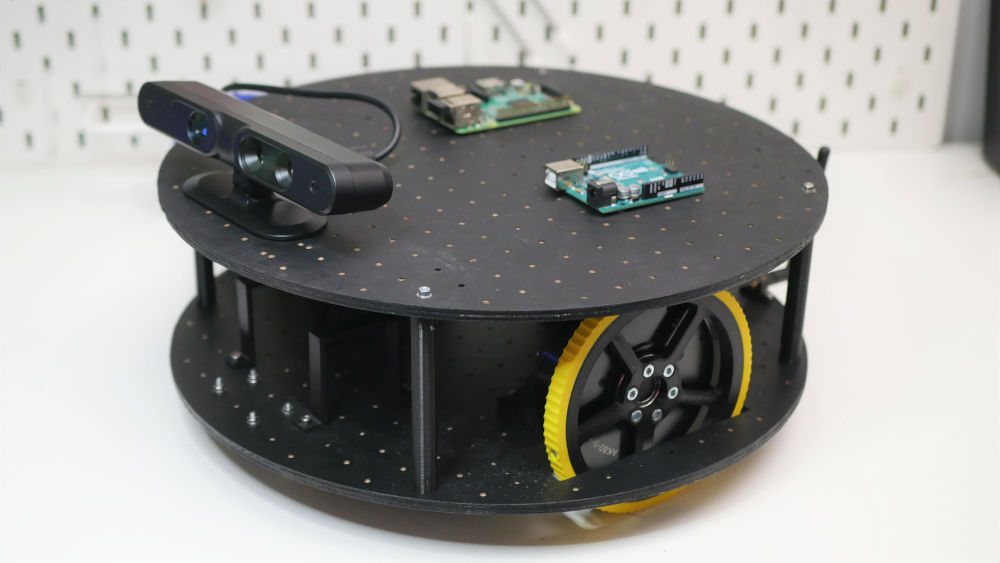

# Overpowered Robotic Chassis

This is a repository with examples on how to use T-Motor AK seires actuator with Arduino and some pytohon scripts. You can also find 3D models of a simple modular chassis that I used to build a robotic platform for future experiments.
For more info check out this video:

Usefull links: 
https://store.tmotor.com/category.php?id=97
https://docs.google.com/document/d/1dzNVzblz6mqB3eZVEMyi2MtSngALHdgpTaDJIW_BpS4
https://github.com/MihaiMoldovanu/robotic/blob/main/arduino/CAN_bus_robot.ino
https://github.com/dfki-ric-underactuated-lab/mini-cheetah-tmotor-python-can